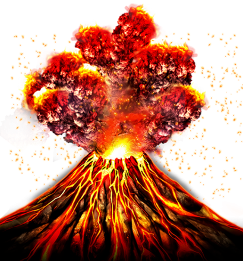
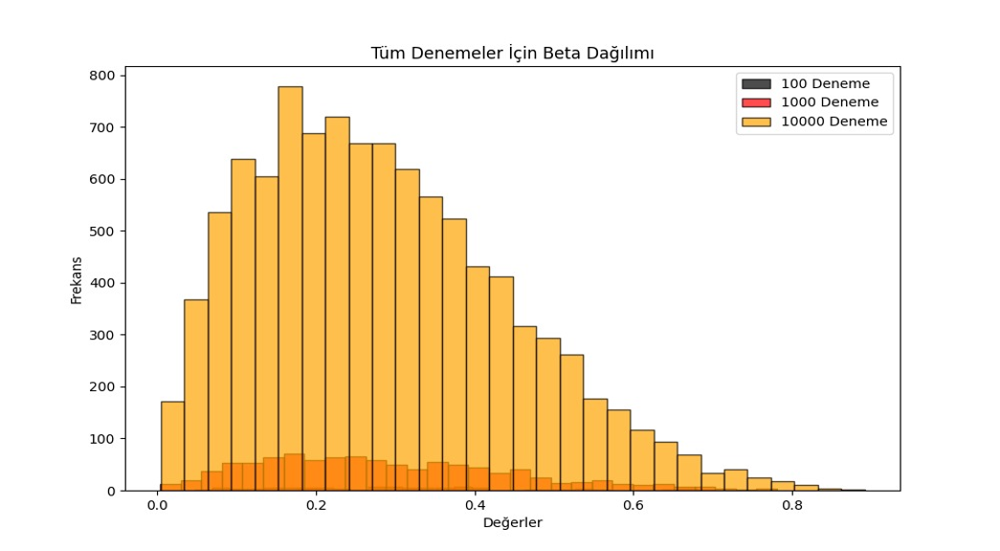

# 🌋 Yanardağ Patlaması Simülasyonu (Volcano Eruption Simulation)

[cite_start]Bu proje, yanardağ patlamalarının fiziksel mekanizmalarını, termodinamik etkilerini ve yerleşim alanları üzerindeki risklerini modern veri bilimi teknikleri ve Python simülasyonları ile analiz eden akademik bir çalışmadır[cite: 1, 2].

## 👥 Proje Ekibi
* [cite_start]**Tuana Akyıldız** - 200205003 [cite: 3]
* [cite_start]**Bulut Evrim Aluç** - 200205054 [cite: 3]

---

## 🚀 Proje Genel Bakışı
[cite_start]Proje, yeraltında biriken magmanın yüksek basınçla yüzeye çıkış sürecini temel alır[cite: 10, 11]. [cite_start]Patlama şiddeti; magmanın gaz içeriği, viskozitesi ve yeraltı basıncı gibi üç ana faktöre bağlı olarak modellenmiştir[cite: 13, 14, 15, 16].

  
   
  [cite_start]<i>Şekil 1: Volkanik Patlamanın Mekanizması ve Görselleştirilmesi [cite: 18]</i>

### ⚙️ Temel Yaklaşım ve Yenilikler
[cite_start]Çalışmamız, literatürdeki mevcut çalışmalardan şu yönleriyle ayrılmaktadır[cite: 34]:
* [cite_start]**Yenilikçi Analiz:** Mesafesel zarar ve dinamik enerji dağılımı modellemesi[cite: 35, 36, 37].
* [cite_start]**Monte Carlo Entegrasyonu:** Olasılık dağılımları (Normal, Gamma, Beta, Log-Normal) kullanılarak gerçekçi tahminler yapılmıştır[cite: 39, 40].
* [cite_start]**Dinamik Takip:** Patlama anındaki şok dalgalarının yerleşim yerlerine etkisi anlık hesaplanmaktadır[cite: 102, 103].

---

## 📂 Kod Yapısı ve Simülasyon Modülleri

### 1. Parametrik İstatistik ve Monte Carlo Analizi
`5_monte_carlo_hesaplaması.py` ve `1_eziliyormuyuz.py` dosyaları projenin matematiksel omurgasını oluşturur.
* [cite_start]**Modellenen Değişkenler:** Katı piroklast yoğunluğu [cite: 250][cite_start], magma sıcaklığı [cite: 722][cite_start], kütle debisi [cite: 852] [cite_start]ve çıkış hızı[cite: 930].
* [cite_start]**Kararlılık:** 10, 100 ve 1000 denemelik setlerle parametre varyansları minimize edilmiştir[cite: 1010, 1011].

  
   
  [cite_start]<i>Şekil 2: Farklı Deneme Sayıları ile Parametrelerin Kararlılık Analizi [cite: 298, 365]</i>

### 2. Isı ve Enerji Etki Modeli
`2_SONmagmalos_v2_random.py` ve `magmalos_v2_02.py` dosyaları, patlamanın çevresel etkilerini görselleştirir.
* [cite_start]**Yerleşim Takibi:** Pompeii (Evrim), Atlantis (Buğra) ve Miyazaki (Tuana) bölgeleri için anlık enerji etki (Energy Impact) hesaplamaları yapılır[cite: 145, 146].
* **Yaşam Riski:** Belirli bir enerji ve sıcaklık eşiği aşıldığında "Ölür/Yaşar" durum değerlendirmesi grafik üzerine yansıtılır.

### 3. 3D Partikül ve Kül Dinamiği
`4_volcanos19.py` ve `6_whatever.py` dosyaları, püsküren maddelerin atmosferdeki hareketini simüle eder.
* [cite_start]**Fiziksel Etkenler:** Reynolds Sayısı modeli ile rüzgar hızı [cite: 99][cite_start], yerçekimi ve hava direnci hesaplamaları[cite: 931].
* **Dinamik Görselleştirme:** Kırmızı (lav), sarı (ısı), gri (kül) ve siyah (kaya) partiküllerin 3 boyutlu dağılımı.

---

## 📊 Önemli Örneklem: 1815 Tambora Patlaması ve "Yazsız Yıl"
[cite_start]Projemiz, 1815 Tambora patlamasının yarattığı küresel iklim değişikliğini (1816 Yazsız Yılı) bir vaka analizi olarak sunar[cite: 1081, 1082].
* [cite_start]Atmosfere yayılan sülfat aerosollerinin güneş ışığını bloke etmesi[cite: 1083].
* [cite_start]Küresel sıcaklıklarda $1-3^{\circ}C$ düşüş ve bunun tarımsal/kültürel etkileri[cite: 1084, 1085].

